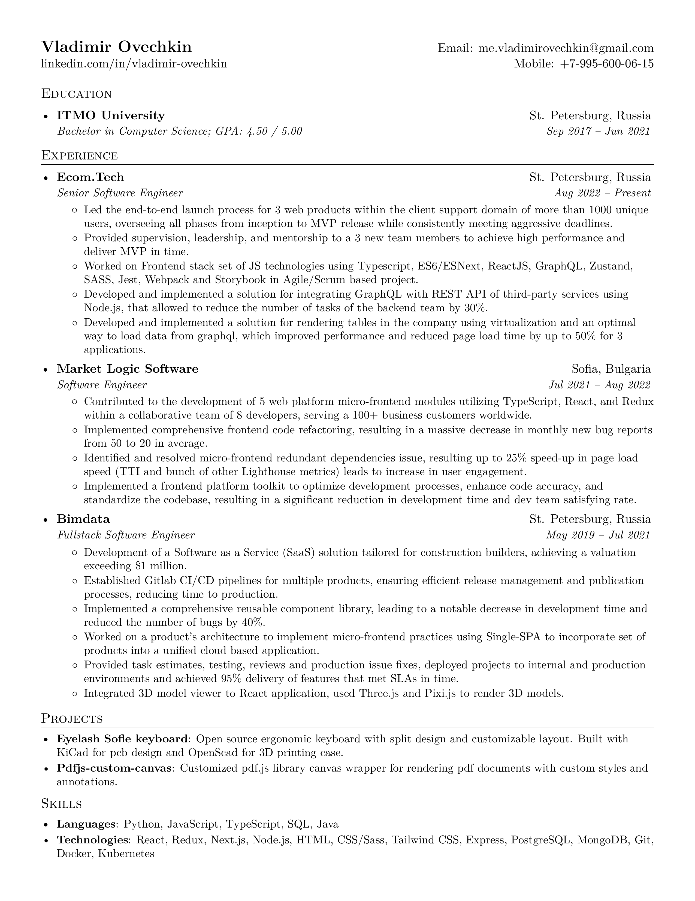

# Vladimir Ovechkin resume

PDF resume builder written with LaTeX. Built inside a Docker container — no local TeX installation required.

## Build

Generates `vladimir_ovechkin_resume.pdf` and `vladimir_ovechkin_resume.png`:

```sh
make build
```

## Watch mode

Automatically rebuilds the resume when `resume.tex` changes:

```sh
make watch
# or
docker compose up
```

## Example

Here is how the resume looks like:



## Credits

- [sb2nov](https://github.com/sb2nov) Thank you for the template!
